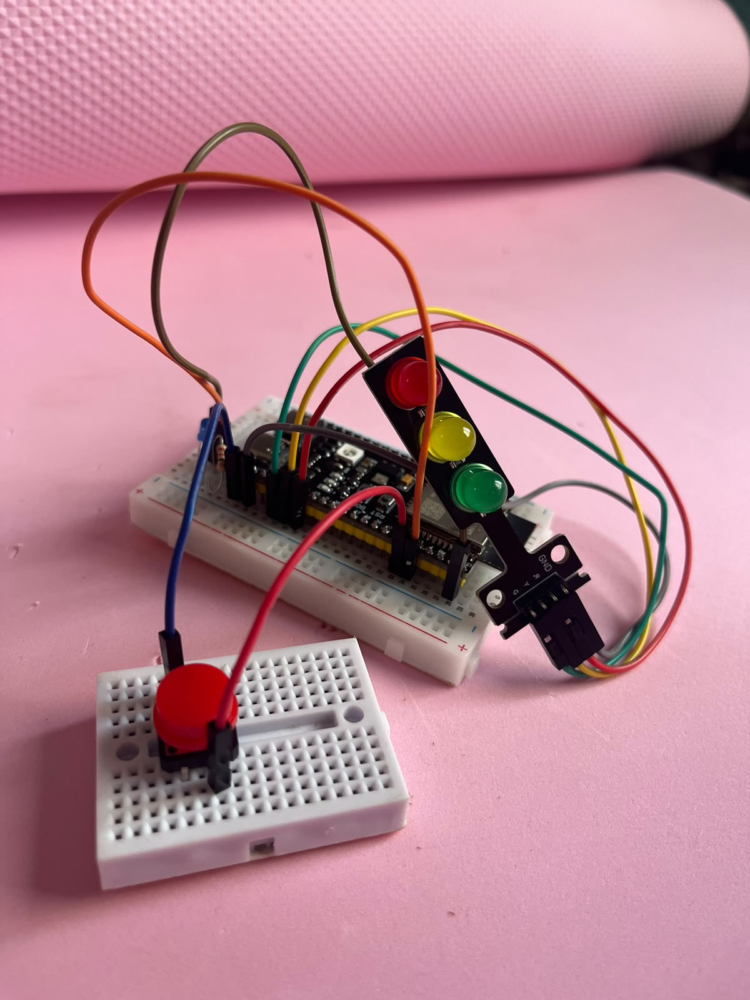

# Dia 1 — O primeiro sinal

<p class="resumo-inicial">No primeiro encontro a placa sai da caixa e faz a primeira coisa
visível: <strong>acender uma luz</strong>. Parece pouco, mas é o momento em que o código
deixa a tela e vira eletricidade. A ideia do dia inteiro cabe numa frase — <strong>um pino
só tem dois estados, e você decide qual</strong>. Tudo que vem depois, motor, sensor,
display e rede, é elaboração em cima disso.</p>

## :material-presentation: Slides da aula

<div class="moldura-slide" markdown="0">
<iframe src="https://www.canva.com/design/DAHUb_scRPU/oeNBIgei-TgZdYx3fND73w/view?embed"
        loading="lazy" allowfullscreen="allowfullscreen" allow="fullscreen"></iframe>
</div>

[Abrir em tela cheia](https://www.canva.com/design/DAHUb_scRPU/oeNBIgei-TgZdYx3fND73w/view){ .baixar target="_blank" }

<small>*SEMUNI — Aula 01*, por Gabriela de Oliveira Lemos.</small>

## :material-clock-outline: Como o dia se organiza

<div class="info-cartoes" markdown="0"><div class="info"><div class="rotulo">14h00 – 14h40</div><div class="valor">Abertura</div><div class="detalhe">o que são sistemas embarcados</div></div><div class="info"><div class="rotulo">14h40 – 15h20</div><div class="valor">ESP32</div><div class="detalhe">ambiente e estrutura do projeto</div></div><div class="info"><div class="rotulo">15h20 – 15h35</div><div class="valor">Intervalo</div></div><div class="info"><div class="rotulo">15h35 – 17h00</div><div class="valor">Prática</div><div class="detalhe">GPIO, botão e protoboard</div></div></div>

## :material-lightbulb: O que você vai aprender

<ul class="lista-icones">
<li>O que é um sistema embarcado e onde eles estão no cotidiano</li>
<li>GPIO: usar um pino como <strong>saída</strong> para acender um LED</li>
<li>Tempo e <code>delay()</code>: fazer o LED piscar</li>
<li>Coordenar várias saídas ao mesmo tempo, no semáforo</li>
<li>GPIO como <strong>entrada</strong>, e o que é <code>INPUT_PULLUP</code></li>
</ul>

## :material-chip: O circuito que vamos montar

Ao final do dia a sua protoboard vai estar assim: a ESP32 no centro, o módulo de semáforo
com os três LEDs, e o botão numa protoboard menor ao lado.

<div class="dupla" markdown="0">

<div>
<p>Os três exercícios abaixo usam esse mesmo circuito. Você monta uma vez e vai trocando só
o código.</p>
<p>Os pinos <strong>48, 47, 21 e 42</strong> são os da placa que usamos na oficina. Testando
em casa com outra ESP32, confira a pinagem da <strong>sua</strong> placa — os números mudam
de modelo para modelo, e esse é um dos erros mais comuns de quem está começando.</p>
</div>
</div>

## :material-numeric-1-circle: Piscar um LED

O "olá, mundo" dos sistemas embarcados. O LED acende por um segundo, apaga por um segundo,
e repete para sempre.

O `setup()` roda **uma vez**, quando a placa liga: é onde se diz que o pino será usado como
saída. O `loop()` roda **para sempre**, do começo ao fim, repetidamente.

```cpp title="ex1_piscaled.ino"
#define LED 2

void setup() {
  pinMode(LED, OUTPUT);
}

void loop() {
  digitalWrite(LED, HIGH);
  delay(1000);
  digitalWrite(LED, LOW);
  delay(1000);
}
```

[Baixar ex1_piscaled.ino](codigo/ex1_piscaled/ex1_piscaled.ino){ .baixar download }

??? question "Por que o LED fica aceso exatamente 1 segundo?"
    Porque `delay(1000)` **para tudo** por 1000 milissegundos. Enquanto ele espera, a placa
    não faz mais nada. É simples e funciona bem aqui, mas é a primeira limitação que você
    vai querer superar quando o projeto precisar fazer duas coisas ao mesmo tempo — que é
    exatamente o assunto do Dia 2.

## :material-numeric-2-circle: Controlar um semáforo

Agora são três LEDs em vez de um. Nada de novo em conceito: é o mesmo `digitalWrite`, só
que repetido para cada cor, na ordem certa.

```cpp title="ex2_semaforo.ino"
#define RED 48
#define YELLOW 47
#define GREEN 21

void setup() {
  pinMode(RED, OUTPUT);
  pinMode(YELLOW, OUTPUT);
  pinMode(GREEN, OUTPUT);
}

void loop() {
  digitalWrite(RED, HIGH);
  delay(1000);
  digitalWrite(RED, LOW);

  digitalWrite(GREEN, HIGH);
  delay(1000);
  digitalWrite(GREEN, LOW);

  digitalWrite(YELLOW, HIGH);
  delay(1000);
  digitalWrite(YELLOW, LOW);
}
```

[Baixar ex2_semaforo.ino](codigo/ex2_semaforo/ex2_semaforo.ino){ .baixar download }

??? question "Dá para mudar o tempo de cada cor?"
    Dá, e é um bom exercício. Um semáforo de verdade não deixa as três cores acesas pelo
    mesmo tempo: o amarelo é sempre bem mais curto. Troque os números dentro dos `delay()`
    e veja.

## :material-numeric-3-circle: Acender um LED com botão

Até aqui o pino só mandou sinal para fora. Agora ele **lê** o mundo: o programa pergunta se
o botão está apertado e decide o que fazer.

```cpp title="ex3_botao.ino"
#define LED 2
#define BOTAO 42

void setup() {
  pinMode(LED, OUTPUT);
  pinMode(BOTAO, INPUT_PULLUP);
}

void loop() {
  if (digitalRead(BOTAO) == LOW) {
    digitalWrite(LED, HIGH);
  } else {
    digitalWrite(LED, LOW);
  }
}
```

[Baixar ex3_botao.ino](codigo/ex3_botao/ex3_botao.ino){ .baixar download }

??? question "Por que apertado é LOW, e não HIGH?"
    Por causa do `INPUT_PULLUP`. A placa liga um resistor interno que mantém o pino em
    **nível alto** quando nada acontece. O botão, quando apertado, conecta esse pino ao
    **terra** — ou seja, puxa para **nível baixo**.

    Parece invertido, mas é o padrão em eletrônica digital, e tem uma vantagem: sem o
    pull-up, um pino solto fica "no ar" e lê valores aleatórios.

## :material-help-circle: Se algo não funcionar

| Sintoma | Causa mais comum |
|---|---|
| A IDE não acha a placa | driver USB faltando, ou cabo que só carrega e não transmite dados |
| Trava em `Connecting...` | segure o botão **BOOT** da placa até a gravação começar |
| O LED não acende | perna curta do LED (catodo) precisa ir ao **GND**, e sempre com resistor |
| Compila mas nada acontece | número do pino diferente do que está ligado na protoboard |
