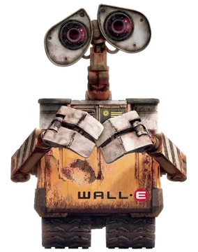

---
hide:
  - navigation
---

SEMUNI 2026 &middot; FCTE/UnB Gama

<h1>Oficina de Introducao aos Sistemas Embarcados</h1>

Tres dias ligando codigo a coisas que se mexem, acendem e reagem ao mundo.
Do primeiro LED que pisca ate um sistema embarcado completo, feito em equipe.

## O que e a oficina

Sistema embarcado e um computador que vive dentro de outra coisa: o carro, a geladeira, o
equipamento medico, o semaforo da esquina. Ele nao tem tela nem teclado — tem **sensores**
para perceber o mundo e **atuadores** para agir sobre ele.

Nesta oficina voce vai **escrever o codigo e ver o efeito no mundo fisico na mesma hora**.
Nada de simulacao: a placa esta na sua frente, o LED acende de verdade e o motor gira de
verdade.

Comecamos no primeiro dia com um LED piscando — o "ola, mundo" dos embarcados — e
terminamos com as equipes integrando sensores, display e motores numa aplicacao completa.

## Para quem e

**Para qualquer pessoa.** A oficina e **gratuita**, aberta ao publico e nao exige
conhecimento previo nem equipamento proprio.

- Nao e preciso saber programar, nem ser da Engenharia, nem ter mexido em eletronica antes
- As equipes sao **mistas**, de modo que quem esta comecando fique junto de quem ja tem
  experiencia
- **Metade das vagas e reservada prioritariamente a mulheres**, para ampliar a participacao
  feminina na computacao e na engenharia
- Todo o material — placas, sensores, motores e componentes — **e disponibilizado pela FCTE**
- Estudantes de ensino medio e de outras instituicoes sao muito bem-vindos

## Quando e onde

| | |
|---|---|
| **Dias** | 22, 23 e 24 de setembro de 2026 |
| **Horario** | 14h as 17h |
| **Carga horaria** | 9 horas |
| **Local** | Laboratorio MOCAP — FCTE, Campus UnB Gama |
| **Vagas** | 30 |
| **Plataforma** | ESP32, programada pela Arduino IDE |
| **Codigo SIGAA** | EV1352-2026 |

## Quem faz acontecer

Renato Coral Sampaio

Coordenacao

<a href="https://github.com/renatocoral">@renatocoral</a>

Gabriela de Oliveira Lemos

Ministrante

<a href="https://github.com/heylisten64">@heylisten64</a>

Genilson Junior

Monitoria

<a href="https://github.com/GenilsonJrs">@GenilsonJrs</a>

Luiz Guilherme Faria

Monitoria

<a href="https://github.com/luizfaria1989">@luizfaria1989</a>

## O caminho dos tres dias

<a class="cartao" href="dia-1/">

Dia 1 &middot; O primeiro sinal

O que e um sistema embarcado, configuracao do ambiente e GPIO:
piscar um LED, controlar um semaforo e ler um botao.

</a>
<a class="cartao" href="dia-2/">

Dia 2 &middot; Varias coisas ao mesmo tempo

Conteudo liberado no dia.

</a>
<a class="cartao" href="dia-3/">

Dia 3 &middot; Colocando em movimento

Conteudo liberado no dia.

</a>

## O que voce leva daqui

Ao final da oficina espera-se que voce compreenda o que caracteriza um sistema embarcado e
reconheca suas aplicacoes no cotidiano; consiga programar um microcontrolador para **ler
entradas e acionar saidas**; tenha exercitado a comunicacao com perifericos e o controle
concorrente de tarefas; e conclua a atividade com uma **aplicacao funcional desenvolvida em
equipe**.

Todo o material fica publicado aqui — slides, codigos e explicacoes — para voce levar para
casa e continuar.
