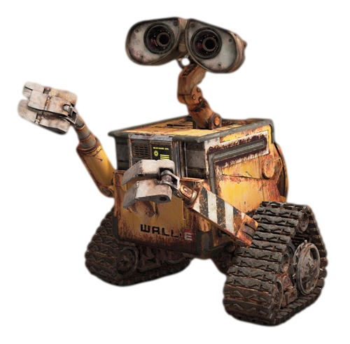
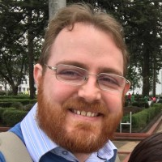

---
hide:
  - navigation
---

<svg class="trilhas" viewBox="0 0 800 320" preserveAspectRatio="none" aria-hidden="true"><g fill="none" stroke="#f0a94a" stroke-width="1.6" opacity=".45"><path d="M30 60 H120 L150 30 H300"/><path d="M30 110 H90 L120 140 H250 L280 110 H420"/><path d="M40 250 H160 L190 280 H360"/><path d="M520 40 H620 L650 70 H780"/><path d="M560 290 H660 L690 260 H790"/></g><g fill="#f0a94a" opacity=".7"><circle cx="30" cy="60" r="4"/><circle cx="300" cy="30" r="4"/><circle cx="30" cy="110" r="4"/><circle cx="420" cy="110" r="4"/><circle cx="40" cy="250" r="4"/><circle cx="360" cy="280" r="4"/><circle cx="780" cy="70" r="4"/><circle cx="790" cy="260" r="4"/></g></svg>
<svg class="lampada-canto" viewBox="0 0 104 190" aria-hidden="true"><defs><linearGradient id="gcone" x1="0" y1="0" x2="0" y2="1"><stop offset="0" stop-color="#ffd08a" stop-opacity=".85"/><stop offset="1" stop-color="#ffb763" stop-opacity="0"/></linearGradient><radialGradient id="ghalo" cx="50%" cy="50%" r="50%"><stop offset="0" stop-color="#ffd08a" stop-opacity=".75"/><stop offset="1" stop-color="#ffd08a" stop-opacity="0"/></radialGradient></defs><line x1="52" y1="0" x2="52" y2="46" stroke="#5a6674" stroke-width="3"/><polygon class="cone" points="52,86 8,190 96,190" fill="url(#gcone)"/><ellipse class="halo" cx="52" cy="82" rx="44" ry="32" fill="url(#ghalo)"/><path d="M52 46 L78 82 L26 82 Z" fill="#7e8a99" stroke="#5a6674" stroke-width="2" stroke-linejoin="round"/><rect x="44" y="40" width="16" height="8" rx="3" fill="#6b7789"/><ellipse class="bulbo" cx="52" cy="86" rx="9" ry="8" fill="#3a3426"/></svg>

SEMUNI 2026 &middot; FCTE/UnB Gama
<h1>Oficina de Introdução aosSistemas Embarcados</h1>

Três dias ligando código a coisas que se mexem, acendem e reagem ao mundo.
Do primeiro LED que pisca até um sistema embarcado completo, feito em equipe.

Sistema embarcado é um computador que vive dentro de outra coisa:
o carro, a geladeira, o equipamento médico, o semáforo da esquina. Ele não tem tela nem
teclado — tem <strong>sensores</strong> para perceber o mundo e <strong>atuadores</strong>
para agir sobre ele. Em três tardes, você vai programar um e ver o efeito acontecer na sua
frente.

## :material-presentation: Comece por aqui

Estes são os slides do primeiro dia. Dá para folhear agora, antes mesmo de a oficina
começar.

<iframe src="https://www.canva.com/design/DAHUb_scRPU/oeNBIgei-TgZdYx3fND73w/view?embed"
        loading="lazy" allowfullscreen="allowfullscreen" allow="fullscreen"></iframe>

[Ver o Dia 1 completo](dia-1/){ .baixar }
[Abrir em tela cheia](https://www.canva.com/design/DAHUb_scRPU/oeNBIgei-TgZdYx3fND73w/view){ .baixar target="_blank" }

&#9881;

Aprendizado prático

Colocando a mão na massa com hardware e software, do primeiro minuto.

&#128268;

Sistemas embarcados

Do básico ao avançado, explorando o mundo dos microcontroladores.

&#128101;

Trabalho em equipe

Equipes mistas de três pessoas, com desafios resolvidos em conjunto.

&#128640;

Projetos reais

Transforme conhecimento em protótipos que funcionam de verdade.

## :material-lightbulb: O que é a oficina

A oficina aproxima a comunidade acadêmica e a população do Distrito Federal do universo dos
sistemas embarcados — os computadores invisíveis que operam dentro de eletrodomésticos,
automóveis, equipamentos médicos e de tantos objetos do cotidiano.

Ao longo de três encontros presenciais e majoritariamente práticos, você vai **escrever o
código e ver o efeito no mundo físico na mesma hora**. Nada de simulação: a placa está na
sua frente, o LED acende de verdade e o motor gira de verdade.

Começamos no primeiro dia com um LED piscando — o "olá, mundo" dos embarcados — e
terminamos com as equipes integrando sensores, display e motores numa aplicação completa.

## :material-account-group: Para quem é

**Para qualquer pessoa.** Não é preciso saber programar, nem ser da Engenharia, nem ter
mexido em eletrônica antes.

<ul class="lista-icones">
<li>Gratuita, aberta ao público e sem pré-requisito nenhum</li>
<li>Equipes mistas, para quem está começando ficar junto de quem já tem experiência</li>
<li>Metade das vagas reservada prioritariamente a mulheres</li>
<li>Placas, sensores, motores e componentes disponibilizados pela FCTE</li>
<li>Estudantes de ensino médio e de outras instituições são bem-vindos</li>
<li>Todo o material publicado aqui, para você levar para casa</li>
</ul>

Em diálogo com o tema da SEMUNI 2026 — *"Democracia em cena: arte, cultura e pertencimento"* —,
a ação compreende o acesso ao conhecimento técnico como uma questão de **pertencimento**,
aproximando da universidade pública pessoas que raramente têm a oportunidade de colocar a
mão em um sistema embarcado.

## :material-calendar: Quando e onde

Dias

22, 23 e 24

de setembro de 2026

Horário

14h às 17h

9 horas no total

Local

Laboratório MOCAP

FCTE, Campus UnB Gama

Vagas

30

metade para mulheres

Investimento

Gratuita

material incluso

## :material-star: Quem faz acontecer

Renato Coral Sampaio

Coordenação

<a href="https://github.com/renatocoral">@renatocoral</a>

Gabriela de Oliveira Lemos

Ministrante

<a href="https://github.com/heylisten64">@heylisten64</a>

Genilson Junior

Monitoria

<a href="https://github.com/GenilsonJrs">@GenilsonJrs</a>

Luiz Guilherme Faria

Monitoria

<a href="https://github.com/luizfaria1989">@luizfaria1989</a>

## :material-map: O caminho dos três dias

<a class="cartao" href="dia-1/">
22 de setembro

Dia 1 &middot; O primeiro sinal

O que é um sistema embarcado, configuração do ambiente e GPIO: piscar um LED, controlar um semáforo e ler um botão.

</a>
<a class="cartao" href="dia-2/">
23 de setembro

Dia 2 &middot; Várias coisas ao mesmo tempo

Conteúdo liberado no dia.

</a>
<a class="cartao" href="dia-3/">
24 de setembro

Dia 3 &middot; Colocando em movimento

Conteúdo liberado no dia.

</a>

## :material-school: O que você leva daqui

Ao final da oficina espera-se que você compreenda o que caracteriza um sistema embarcado e
reconheça suas aplicações no cotidiano; consiga programar um microcontrolador para **ler
entradas e acionar saídas**; tenha exercitado a comunicação com periféricos e o controle
concorrente de tarefas; e conclua a atividade com uma **aplicação funcional desenvolvida em
equipe**.
