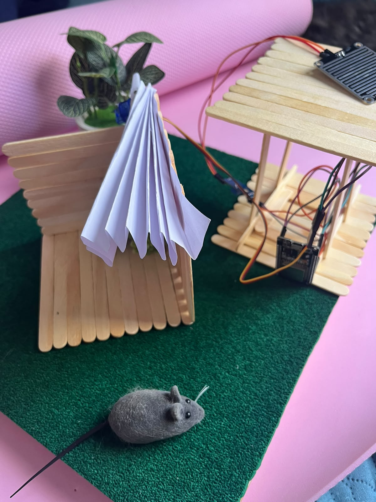

# Projetos

Duas coleções diferentes: os projetos de mostra que montamos para esta oficina, e os
trabalhos que os alunos da disciplina de Sistemas Embarcados já construíram.

## Projetos de mostra da oficina

Montados pela equipe para a SEMUNI 2026. Clique para ver o código e baixar.

<div class="cartoes" markdown="0">
<a class="cartao" href="#carrinho-dirigido-pelo-navegador"><div class="titulo">Carrinho Wi-Fi</div><div class="resumo">Cria a própria rede e é dirigido pelo navegador.</div></a>
<a class="cartao" href="#casa-com-telhado-que-fecha-na-chuva"><div class="titulo">Casa na chuva</div><div class="resumo">Sensor de chuva fecha o telhado sozinho.</div></a>
<a class="cartao" href="#radar-de-varredura"><div class="titulo">Radar</div><div class="resumo">Servo varre um sensor de distância e apita.</div></a>
<a class="cartao" href="#jogo-da-memoria"><div class="titulo">Jogo da memória</div><div class="resumo">Estilo Genius, com placar e display OLED.</div></a>
<a class="cartao" href="#cyberdeck"><div class="titulo">Cyberdeck</div><div class="resumo">Raspberry Pi com display numa caixa de madeira.</div></a>
</div>

### Carrinho dirigido pelo navegador

Um chassi de quatro rodas com ESP32 e ponte H L298N. A placa **cria a própria rede Wi-Fi**,
serve uma página de controle, e cada pessoa entra com o próprio nome para dirigir.

O detalhe mais interessante do projeto é elétrico, não de código: a ponte H tem **dois
canais para quatro motores**, então os dois motores de um lado sempre recebem a mesma
tensão. Se uma roda gira ao contrário, nenhum ajuste de software resolve — é fio trocado.

??? example "Ver o código dos motores"
    Esta é a parte que interessa para quem está começando: só `pinMode`, `analogWrite` e
    um `if`. Toda a parte de Wi-Fi fica em outro arquivo.

    ```cpp title="motores.ino"
    int dutyEsquerdaFrente = 0;
    int dutyEsquerdaTras = 0;
    int dutyDireitaFrente = 0;
    int dutyDireitaTras = 0;

    void prepararMotores() {
      pinMode(PINO_ESQUERDA_FRENTE, OUTPUT);
      pinMode(PINO_ESQUERDA_TRAS, OUTPUT);
      pinMode(PINO_DIREITA_FRENTE, OUTPUT);
      pinMode(PINO_DIREITA_TRAS, OUTPUT);
    }

    int forca(int potencia) {
      if (potencia < 0) {
        potencia = 0;
      }
      if (potencia > 100) {
        potencia = 100;
      }
      return map(potencia, 0, 100, 0, 255);
    }

    void ladoEsquerdo(bool paraFrente, bool paraTras, int potencia) {
      if (INVERTER_LADO_ESQUERDO) {
        bool guarda = paraFrente;
        paraFrente = paraTras;
        paraTras = guarda;
      }
      dutyEsquerdaFrente = paraFrente ? forca(potencia) : 0;
      dutyEsquerdaTras = paraTras ? forca(potencia) : 0;
      analogWrite(PINO_ESQUERDA_FRENTE, dutyEsquerdaFrente);
      analogWrite(PINO_ESQUERDA_TRAS, dutyEsquerdaTras);
    }

    void ladoDireito(bool paraFrente, bool paraTras, int potencia) {
      if (INVERTER_LADO_DIREITO) {
        bool guarda = paraFrente;
        paraFrente = paraTras;
        paraTras = guarda;
      }
      dutyDireitaFrente = paraFrente ? forca(potencia) : 0;
      dutyDireitaTras = paraTras ? forca(potencia) : 0;
      analogWrite(PINO_DIREITA_FRENTE, dutyDireitaFrente);
      analogWrite(PINO_DIREITA_TRAS, dutyDireitaTras);
    }

    void frente() {
      ladoEsquerdo(true, false, POTENCIA);
      ladoDireito(true, false, POTENCIA);
    }

    void tras() {
      ladoEsquerdo(false, true, POTENCIA);
      ladoDireito(false, true, POTENCIA);
    }

    void esquerda() {
      ladoEsquerdo(false, true, POTENCIA_DA_CURVA);
      ladoDireito(true, false, POTENCIA_DA_CURVA);
    }

    void direita() {
      ladoEsquerdo(true, false, POTENCIA_DA_CURVA);
      ladoDireito(false, true, POTENCIA_DA_CURVA);
    }

    void parar() {
      ladoEsquerdo(false, false, 0);
      ladoDireito(false, false, 0);
    }

    bool executar(String acao) {
      if (acao == "frente") {
        frente();
        return true;
      }
      if (acao == "tras") {
        tras();
        return true;
      }
      if (acao == "esquerda") {
        esquerda();
        return true;
      }
      if (acao == "direita") {
        direita();
        return true;
      }
      if (acao == "parar") {
        parar();
        return true;
      }
      return false;
    }
    ```

[Baixar carrinho.ino](codigo/carrinho-wifi/carrinho.ino){ .baixar download }
[Baixar motores.ino](codigo/carrinho-wifi/motores.ino){ .baixar download }
[Baixar paginas.ino](codigo/carrinho-wifi/paginas.ino){ .baixar download }

### Casa com telhado que fecha na chuva

Uma maquete de casa em que o telhado se fecha sozinho quando começa a chover. Um sensor de
chuva detecta as gotas e um servo motor move um leque que cobre o varal.

Depois que a chuva passa, ele **espera dez segundos antes de reabrir** — sem essa espera o
telhado ficaria batendo enquanto a água evapora e a leitura oscila em cima do limiar.

??? example "Ver o código completo"

    ```cpp title="casa.ino"
    const int PINO_DO_SERVO = 13;
    const int PINO_DO_SENSOR = 34;

    const int ANGULO_SEM_CHUVA = 62;
    const int ANGULO_COM_CHUVA = 0;

    const int LIMIAR_CHUVA = 3600;
    const int LIMIAR_SECO = 3950;

    const unsigned long ESPERA_PARA_ABRIR_MS = 10000;
    const int MS_POR_GRAU = 40;

    const int PULSO_MINIMO = 500;
    const int PULSO_MAXIMO = 2400;
    const int FREQUENCIA = 50;
    const int RESOLUCAO = 16;
    const int AMOSTRAS = 15;
    const int CONFIRMACOES = 5;
    const unsigned long INTERVALO_DA_LEITURA_MS = 200;

    int anguloAtual = -1;
    int votosMolhado = 0;
    int votosSeco = 0;
    bool estaChovendo = false;
    bool naPosicaoDeChuva = false;
    unsigned long secouDesde = 0;
    unsigned long ultimaLeitura = 0;

    int dutyDoAngulo(int angulo) {
      long pulso = map(angulo, 0, 180, PULSO_MINIMO, PULSO_MAXIMO);
      long periodo = 1000000L / FREQUENCIA;
      return pulso * ((1L << RESOLUCAO) - 1) / periodo;
    }

    int dentroDoCurso(int angulo) {
      int menor = min(ANGULO_SEM_CHUVA, ANGULO_COM_CHUVA);
      int maior = max(ANGULO_SEM_CHUVA, ANGULO_COM_CHUVA);
      if (angulo < menor) {
        return menor;
      }
      if (angulo > maior) {
        return maior;
      }
      return angulo;
    }

    void moverPara(int alvo) {
      alvo = dentroDoCurso(alvo);
      if (anguloAtual < 0) {
        anguloAtual = alvo;
        ledcWrite(PINO_DO_SERVO, dutyDoAngulo(alvo));
        return;
      }
      int passo = (alvo > anguloAtual) ? 1 : -1;
      while (anguloAtual != alvo) {
        anguloAtual += passo;
        ledcWrite(PINO_DO_SERVO, dutyDoAngulo(anguloAtual));
        delay(MS_POR_GRAU);
      }
    }

    void reagirAChuva() {
      Serial.print(">> CHUVA detectada - indo para ");
      Serial.print(ANGULO_COM_CHUVA);
      Serial.println(" graus");
      moverPara(ANGULO_COM_CHUVA);
      naPosicaoDeChuva = true;
    }

    void voltarAoRepouso() {
      Serial.print(">> seco ha 10s - voltando para ");
      Serial.print(ANGULO_SEM_CHUVA);
      Serial.println(" graus");
      moverPara(ANGULO_SEM_CHUVA);
      naPosicaoDeChuva = false;
    }

    int lerSensor() {
      int v[AMOSTRAS];
      for (int i = 0; i < AMOSTRAS; i++) {
        v[i] = analogRead(PINO_DO_SENSOR);
        delay(2);
      }
      for (int i = 1; i < AMOSTRAS; i++) {
        int chave = v[i];
        int j = i - 1;
        while (j >= 0 && v[j] > chave) {
          v[j + 1] = v[j];
          j--;
        }
        v[j + 1] = chave;
      }
      return v[AMOSTRAS / 2];
    }

    void setup() {
      Serial.begin(115200);
      analogReadResolution(12);
      ledcAttach(PINO_DO_SERVO, FREQUENCIA, RESOLUCAO);
      delay(400);

      Serial.println();
      Serial.println("=== CASA COM TELHADO NA CHUVA ===");
      Serial.print("Sem chuva (repouso): ");
      Serial.print(ANGULO_SEM_CHUVA);
      Serial.print(" graus   Com chuva: ");
      Serial.print(ANGULO_COM_CHUVA);
      Serial.println(" graus");
      Serial.print("Chove abaixo de ");
      Serial.print(LIMIAR_CHUVA);
      Serial.print("   seco acima de ");
      Serial.println(LIMIAR_SECO);
      Serial.print("Espera para reabrir: ");
      Serial.print(ESPERA_PARA_ABRIR_MS / 1000);
      Serial.println(" s");
      Serial.println("=================================");

      anguloAtual = ANGULO_COM_CHUVA;
      ledcWrite(PINO_DO_SERVO, dutyDoAngulo(ANGULO_COM_CHUVA));
      delay(400);
      moverPara(ANGULO_SEM_CHUVA);
      Serial.print("repouso: ");
      Serial.print(ANGULO_SEM_CHUVA);
      Serial.println(" graus");
    }

    void loop() {
      if (millis() - ultimaLeitura < INTERVALO_DA_LEITURA_MS) {
        return;
      }
      ultimaLeitura = millis();

      int valor = lerSensor();

      if (valor < LIMIAR_CHUVA) {
        votosMolhado++;
        votosSeco = 0;
      } else if (valor > LIMIAR_SECO) {
        votosSeco++;
        votosMolhado = 0;
      }

      if (!estaChovendo && votosMolhado >= CONFIRMACOES) {
        estaChovendo = true;
        Serial.print("sensor ");
        Serial.print(valor);
        Serial.print("  -> molhado (confirmado ");
        Serial.print(CONFIRMACOES);
        Serial.println("x)");
      } else if (estaChovendo && votosSeco >= CONFIRMACOES) {
        estaChovendo = false;
        secouDesde = millis();
        Serial.print("sensor ");
        Serial.print(valor);
        Serial.print("  -> secou (confirmado ");
        Serial.print(CONFIRMACOES);
        Serial.println("x), contando 10s");
      }

      if (estaChovendo && !naPosicaoDeChuva) {
        reagirAChuva();
      }

      if (!estaChovendo && naPosicaoDeChuva) {
        if (millis() - secouDesde >= ESPERA_PARA_ABRIR_MS) {
          voltarAoRepouso();
        }
      }
    }
    ```

[Baixar casa.ino](codigo/casa-telhado/casa.ino){ .baixar download }

### Radar de varredura

Um servo gira um sensor ultrassônico de um lado para o outro. Quando aparece um objeto à
frente, a varredura **para** e o buzzer apita com cadência proporcional à proximidade —
mais perto, mais rápido, como sensor de ré.

!!! note "Código em preparação"
    Este projeto foi escrito em MicroPython. A versão em Arduino IDE, para ficar no mesmo
    padrão dos outros, será publicada aqui.

### Cyberdeck

Um Raspberry Pi com display montado dentro de uma caixa de madeira — um computador portátil
de bancada, para levar o ambiente de desenvolvimento junto com os projetos.

{ .foto-projeto }

### Jogo da memória

Estilo Genius: o sistema pisca uma sequência de cores, o jogador repete nos botões, e a
sequência cresce a cada fase. Tem display OLED, som próprio para cada cor e placar salvo na
memória, que sobrevive a desligar a placa.

!!! note "Código em preparação"
    Este projeto foi escrito em MicroPython, para Raspberry Pi Pico. A versão em Arduino
    IDE será publicada aqui.

## Projetos da disciplina

Trabalhos construídos pelos alunos de **Fundamentos de Sistemas Embarcados** (FGA/UnB), na
organização [FGA-FSE](https://github.com/FGA-FSE). São projetos de disciplina, feitos por
estudantes de graduação — uma amostra do que dá para construir depois de aprender o básico.

<div class="cartoes" markdown="0">
<a class="cartao" href="https://github.com/FGA-FSE/Trabalho-3-Mayara-Raquel" target="_blank"><div class="titulo">Incubadora inteligente</div><div class="resumo">Controle de temperatura e umidade com ESP32.</div></a>
<a class="cartao" href="https://github.com/FGA-FSE/trabalho-3-fabio-mateus_cavati-ricardo-ryan" target="_blank"><div class="titulo">Controle com sensor de pressão</div><div class="resumo">Botões sensíveis à pressão num controle de videogame.</div></a>
<a class="cartao" href="https://github.com/FGA-FSE/trabalho-final-smart-lock" target="_blank"><div class="titulo">Fechadura inteligente</div><div class="resumo">Smart lock com acionamento eletrônico.</div></a>
<a class="cartao" href="https://github.com/FGA-FSE/trabalho-final-robomasters1" target="_blank"><div class="titulo">RoboMasters</div><div class="resumo">Projeto final de robótica da disciplina.</div></a>
<a class="cartao" href="https://github.com/FGA-FSE/trabalho-1-entrega-3-mayara-alves" target="_blank"><div class="titulo">Simulador de trânsito</div><div class="resumo">Semáforos e fluxo de veículos simulados.</div></a>
<a class="cartao" href="https://github.com/FGA-FSE/trabalho-2-termostato-nest-gustavo-yasmin" target="_blank"><div class="titulo">Termostato</div><div class="resumo">Estudo e reprodução de um termostato comercial.</div></a>
<a class="cartao" href="https://github.com/FGA-FSE/Trabalho-2-Mayara-Raquel-Lucas-Joao" target="_blank"><div class="titulo">Estudo da incubadora Brinsea</div><div class="resumo">Engenharia reversa de uma chocadeira comercial.</div></a>
<a class="cartao" href="https://github.com/FGA-FSE/trabalho-2-ryan-mateus_cavati-ricardo-fabio" target="_blank"><div class="titulo">Pressão em controle de PS4</div><div class="resumo">Viabilidade de sensores de pressão nos botões.</div></a>
<a class="cartao" href="https://github.com/FGA-FSE/trabalho-final-prof-daniel-kaua-arthur-davi" target="_blank"><div class="titulo">Trabalho final — Kauã, Arthur e Davi</div><div class="resumo">Projeto integrador da disciplina.</div></a>
<a class="cartao" href="https://github.com/FGA-FSE/trabalho-final-prof-daniel-manoela-victor-trabalho-final" target="_blank"><div class="titulo">Trabalho final — Manoela e Victor</div><div class="resumo">Projeto integrador da disciplina.</div></a>
<a class="cartao" href="https://github.com/FGA-FSE" target="_blank"><div class="titulo">Ver todos</div><div class="resumo">A organização completa da disciplina no GitHub.</div></a>
</div>
