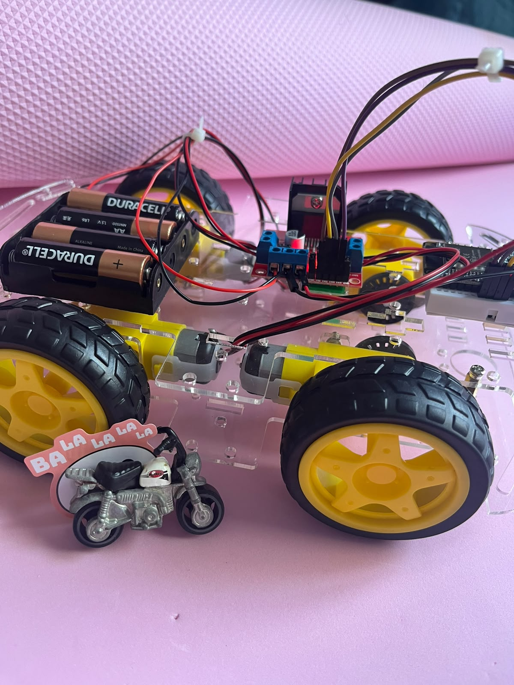

# Projetos

Duas coleções diferentes, cada uma com o seu propósito.

<a class="cartao" href="oficina/">

5 projetos

Feitos para a oficina

Os projetos de mostra que a equipe montou para a SEMUNI 2026. Com o código completo em Arduino IDE, explicação e download.

</a>
<a class="cartao" href="disciplina/">

<svg viewBox="0 0 24 24" aria-hidden="true"><path fill="currentColor" d="M12 .5C5.7.5.5 5.7.5 12c0 5.1 3.3 9.4 7.8 10.9.6.1.8-.2.8-.6v-2c-3.2.7-3.9-1.5-3.9-1.5-.5-1.3-1.3-1.7-1.3-1.7-1-.7.1-.7.1-.7 1.1.1 1.7 1.1 1.7 1.1 1 1.7 2.6 1.2 3.3.9.1-.7.4-1.2.7-1.5-2.6-.3-5.3-1.3-5.3-5.8 0-1.3.5-2.3 1.2-3.2-.1-.3-.5-1.5.1-3.1 0 0 1-.3 3.2 1.2.9-.3 1.9-.4 2.9-.4s2 .1 2.9.4c2.2-1.5 3.2-1.2 3.2-1.2.6 1.6.2 2.8.1 3.1.8.9 1.2 1.9 1.2 3.2 0 4.5-2.7 5.5-5.3 5.8.4.4.8 1.1.8 2.2v3.3c0 .4.2.7.8.6 4.6-1.5 7.8-5.8 7.8-10.9C23.5 5.7 18.3.5 12 .5z"/></svg>FGA-FSE

10 projetos

Da disciplina

Trabalhos construídos pelos alunos de Fundamentos de Sistemas Embarcados, na FGA/UnB. Uma amostra do que dá para fazer depois do básico.

</a>

## Qual é a diferença

Os **projetos da oficina** foram montados por nós para serem demonstrados durante os três
dias. Eles existem para você ver funcionando, abrir o código e entender como cada peça se
liga — e todos estão em Arduino IDE, no mesmo nível dos exercícios das aulas.

Os **projetos da disciplina** são trabalhos de graduação em Fundamentos de Sistemas
Embarcados. São mais longos e mais complexos, e servem de horizonte: é aonde dá para chegar
depois de dominar o que a oficina ensina.
