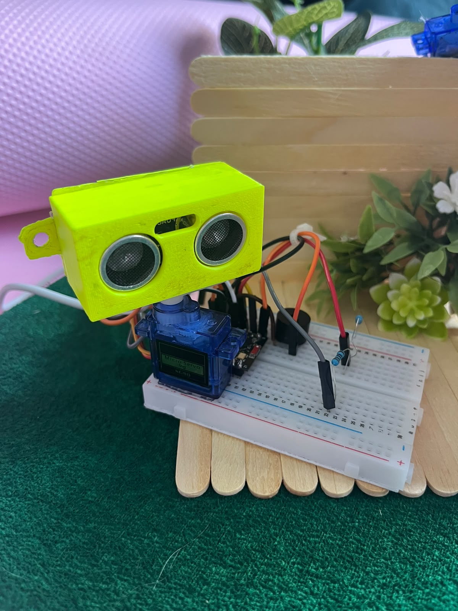
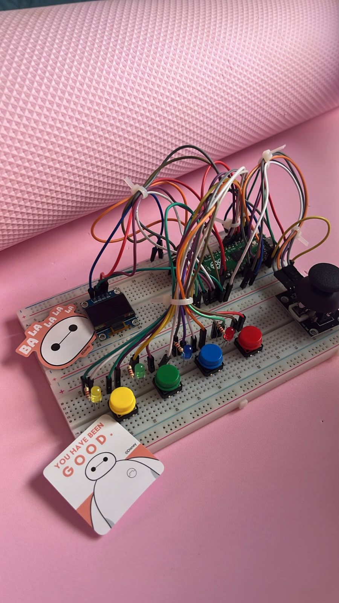
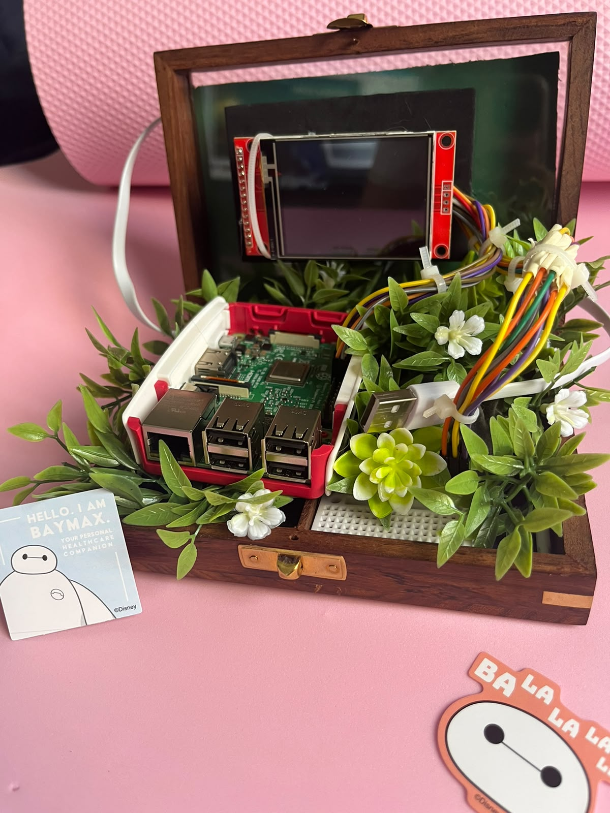

# Projetos feitos para a oficina

Montados pela equipe para a SEMUNI 2026. Todos em **Arduino IDE**, no mesmo nível dos
exercícios das aulas. Clique num cartão para ir direto ao código.

<div class="cartoes" markdown="0">
<a class="cartao" href="#carrinho-dirigido-pelo-navegador"><div class="corpo"><span class="marca">ESP32</span><div class="titulo">Carrinho Wi-Fi</div><div class="resumo">Cria a própria rede e é dirigido pelo navegador.</div></div></a>
<a class="cartao" href="#casa-com-telhado-que-fecha-na-chuva"><div class="corpo"><span class="marca">ESP32</span><div class="titulo">Casa na chuva</div><div class="resumo">Sensor de chuva fecha o telhado sozinho.</div></div></a>
<a class="cartao" href="#radar-de-varredura"><div class="corpo"><span class="marca">ESP32</span><div class="titulo">Radar de varredura</div><div class="resumo">Servo varre um sensor de distância e apita.</div></div></a>
<a class="cartao" href="#jogo-da-memoria"><div class="corpo"><span class="marca">ESP32</span><div class="titulo">Jogo da memória</div><div class="resumo">Estilo Genius, com sequência que cresce a cada fase.</div></div></a>
<a class="cartao" href="#cyberdeck"><div class="corpo"><span class="marca">Raspberry Pi</span><div class="titulo">Cyberdeck</div><div class="resumo">Raspberry Pi com display numa caixa de madeira.</div></div></a>
</div>

## Carrinho dirigido pelo navegador

{ .foto-projeto }

Um chassi de quatro rodas com ESP32 e ponte H L298N. A placa **cria a própria rede Wi-Fi**,
serve uma página de controle, e cada pessoa entra com o próprio nome para dirigir.

O detalhe mais interessante do projeto é elétrico, não de código: a ponte H tem **dois
canais para quatro motores**, então os dois motores de um lado sempre recebem a mesma
tensão. Se uma roda gira ao contrário, nenhum ajuste de software resolve — é fio trocado.

??? example "Ver o código dos motores"
    Esta é a parte que interessa para quem está começando: só `pinMode`, `analogWrite` e
    um `if`. Toda a parte de Wi-Fi fica em outro arquivo.

    ```cpp title="motores.ino"
    int dutyEsquerdaFrente = 0;
    int dutyEsquerdaTras = 0;
    int dutyDireitaFrente = 0;
    int dutyDireitaTras = 0;

    void prepararMotores() {
      pinMode(PINO_ESQUERDA_FRENTE, OUTPUT);
      pinMode(PINO_ESQUERDA_TRAS, OUTPUT);
      pinMode(PINO_DIREITA_FRENTE, OUTPUT);
      pinMode(PINO_DIREITA_TRAS, OUTPUT);
    }

    int forca(int potencia) {
      if (potencia < 0) {
        potencia = 0;
      }
      if (potencia > 100) {
        potencia = 100;
      }
      return map(potencia, 0, 100, 0, 255);
    }

    void ladoEsquerdo(bool paraFrente, bool paraTras, int potencia) {
      if (INVERTER_LADO_ESQUERDO) {
        bool guarda = paraFrente;
        paraFrente = paraTras;
        paraTras = guarda;
      }
      dutyEsquerdaFrente = paraFrente ? forca(potencia) : 0;
      dutyEsquerdaTras = paraTras ? forca(potencia) : 0;
      analogWrite(PINO_ESQUERDA_FRENTE, dutyEsquerdaFrente);
      analogWrite(PINO_ESQUERDA_TRAS, dutyEsquerdaTras);
    }

    void ladoDireito(bool paraFrente, bool paraTras, int potencia) {
      if (INVERTER_LADO_DIREITO) {
        bool guarda = paraFrente;
        paraFrente = paraTras;
        paraTras = guarda;
      }
      dutyDireitaFrente = paraFrente ? forca(potencia) : 0;
      dutyDireitaTras = paraTras ? forca(potencia) : 0;
      analogWrite(PINO_DIREITA_FRENTE, dutyDireitaFrente);
      analogWrite(PINO_DIREITA_TRAS, dutyDireitaTras);
    }

    void frente() {
      ladoEsquerdo(true, false, POTENCIA);
      ladoDireito(true, false, POTENCIA);
    }

    void tras() {
      ladoEsquerdo(false, true, POTENCIA);
      ladoDireito(false, true, POTENCIA);
    }

    void esquerda() {
      ladoEsquerdo(false, true, POTENCIA_DA_CURVA);
      ladoDireito(true, false, POTENCIA_DA_CURVA);
    }

    void direita() {
      ladoEsquerdo(true, false, POTENCIA_DA_CURVA);
      ladoDireito(false, true, POTENCIA_DA_CURVA);
    }

    void parar() {
      ladoEsquerdo(false, false, 0);
      ladoDireito(false, false, 0);
    }

    bool executar(String acao) {
      if (acao == "frente") {
        frente();
        return true;
      }
      if (acao == "tras") {
        tras();
        return true;
      }
      if (acao == "esquerda") {
        esquerda();
        return true;
      }
      if (acao == "direita") {
        direita();
        return true;
      }
      if (acao == "parar") {
        parar();
        return true;
      }
      return false;
    }
    ```

[Baixar carrinho.ino](../codigo/carrinho-wifi/carrinho.ino){ .baixar download }
[Baixar motores.ino](../codigo/carrinho-wifi/motores.ino){ .baixar download }
[Baixar paginas.ino](../codigo/carrinho-wifi/paginas.ino){ .baixar download }

## Casa com telhado que fecha na chuva

{ .foto-projeto }

Uma maquete de casa em que o telhado se fecha sozinho quando começa a chover. Um sensor de
chuva detecta as gotas e um servo motor move um leque que cobre o varal.

Depois que a chuva passa, ele **espera dez segundos antes de reabrir** — sem essa espera o
telhado ficaria batendo enquanto a água evapora e a leitura oscila em cima do limiar.

??? example "Ver o código completo"

    ```cpp title="casa.ino"
    const int PINO_DO_SERVO = 13;
    const int PINO_DO_SENSOR = 34;

    const int ANGULO_SEM_CHUVA = 62;
    const int ANGULO_COM_CHUVA = 0;

    const int LIMIAR_CHUVA = 3600;
    const int LIMIAR_SECO = 3950;

    const unsigned long ESPERA_PARA_ABRIR_MS = 10000;
    const int MS_POR_GRAU = 40;

    const int PULSO_MINIMO = 500;
    const int PULSO_MAXIMO = 2400;
    const int FREQUENCIA = 50;
    const int RESOLUCAO = 16;
    const int AMOSTRAS = 15;
    const int CONFIRMACOES = 5;
    const unsigned long INTERVALO_DA_LEITURA_MS = 200;

    int anguloAtual = -1;
    int votosMolhado = 0;
    int votosSeco = 0;
    bool estaChovendo = false;
    bool naPosicaoDeChuva = false;
    unsigned long secouDesde = 0;
    unsigned long ultimaLeitura = 0;

    int dutyDoAngulo(int angulo) {
      long pulso = map(angulo, 0, 180, PULSO_MINIMO, PULSO_MAXIMO);
      long periodo = 1000000L / FREQUENCIA;
      return pulso * ((1L << RESOLUCAO) - 1) / periodo;
    }

    int dentroDoCurso(int angulo) {
      int menor = min(ANGULO_SEM_CHUVA, ANGULO_COM_CHUVA);
      int maior = max(ANGULO_SEM_CHUVA, ANGULO_COM_CHUVA);
      if (angulo < menor) {
        return menor;
      }
      if (angulo > maior) {
        return maior;
      }
      return angulo;
    }

    void moverPara(int alvo) {
      alvo = dentroDoCurso(alvo);
      if (anguloAtual < 0) {
        anguloAtual = alvo;
        ledcWrite(PINO_DO_SERVO, dutyDoAngulo(alvo));
        return;
      }
      int passo = (alvo > anguloAtual) ? 1 : -1;
      while (anguloAtual != alvo) {
        anguloAtual += passo;
        ledcWrite(PINO_DO_SERVO, dutyDoAngulo(anguloAtual));
        delay(MS_POR_GRAU);
      }
    }

    void reagirAChuva() {
      Serial.print(">> CHUVA detectada - indo para ");
      Serial.print(ANGULO_COM_CHUVA);
      Serial.println(" graus");
      moverPara(ANGULO_COM_CHUVA);
      naPosicaoDeChuva = true;
    }

    void voltarAoRepouso() {
      Serial.print(">> seco ha 10s - voltando para ");
      Serial.print(ANGULO_SEM_CHUVA);
      Serial.println(" graus");
      moverPara(ANGULO_SEM_CHUVA);
      naPosicaoDeChuva = false;
    }

    int lerSensor() {
      int v[AMOSTRAS];
      for (int i = 0; i < AMOSTRAS; i++) {
        v[i] = analogRead(PINO_DO_SENSOR);
        delay(2);
      }
      for (int i = 1; i < AMOSTRAS; i++) {
        int chave = v[i];
        int j = i - 1;
        while (j >= 0 && v[j] > chave) {
          v[j + 1] = v[j];
          j--;
        }
        v[j + 1] = chave;
      }
      return v[AMOSTRAS / 2];
    }

    void setup() {
      Serial.begin(115200);
      analogReadResolution(12);
      ledcAttach(PINO_DO_SERVO, FREQUENCIA, RESOLUCAO);
      delay(400);

      Serial.println();
      Serial.println("=== CASA COM TELHADO NA CHUVA ===");
      Serial.print("Sem chuva (repouso): ");
      Serial.print(ANGULO_SEM_CHUVA);
      Serial.print(" graus   Com chuva: ");
      Serial.print(ANGULO_COM_CHUVA);
      Serial.println(" graus");
      Serial.print("Chove abaixo de ");
      Serial.print(LIMIAR_CHUVA);
      Serial.print("   seco acima de ");
      Serial.println(LIMIAR_SECO);
      Serial.print("Espera para reabrir: ");
      Serial.print(ESPERA_PARA_ABRIR_MS / 1000);
      Serial.println(" s");
      Serial.println("=================================");

      anguloAtual = ANGULO_COM_CHUVA;
      ledcWrite(PINO_DO_SERVO, dutyDoAngulo(ANGULO_COM_CHUVA));
      delay(400);
      moverPara(ANGULO_SEM_CHUVA);
      Serial.print("repouso: ");
      Serial.print(ANGULO_SEM_CHUVA);
      Serial.println(" graus");
    }

    void loop() {
      if (millis() - ultimaLeitura < INTERVALO_DA_LEITURA_MS) {
        return;
      }
      ultimaLeitura = millis();

      int valor = lerSensor();

      if (valor < LIMIAR_CHUVA) {
        votosMolhado++;
        votosSeco = 0;
      } else if (valor > LIMIAR_SECO) {
        votosSeco++;
        votosMolhado = 0;
      }

      if (!estaChovendo && votosMolhado >= CONFIRMACOES) {
        estaChovendo = true;
        Serial.print("sensor ");
        Serial.print(valor);
        Serial.print("  -> molhado (confirmado ");
        Serial.print(CONFIRMACOES);
        Serial.println("x)");
      } else if (estaChovendo && votosSeco >= CONFIRMACOES) {
        estaChovendo = false;
        secouDesde = millis();
        Serial.print("sensor ");
        Serial.print(valor);
        Serial.print("  -> secou (confirmado ");
        Serial.print(CONFIRMACOES);
        Serial.println("x), contando 10s");
      }

      if (estaChovendo && !naPosicaoDeChuva) {
        reagirAChuva();
      }

      if (!estaChovendo && naPosicaoDeChuva) {
        if (millis() - secouDesde >= ESPERA_PARA_ABRIR_MS) {
          voltarAoRepouso();
        }
      }
    }
    ```

[Baixar casa.ino](../codigo/casa-telhado/casa.ino){ .baixar download }

## Radar de varredura

{ .foto-projeto }

Um servo gira um sensor ultrassônico de um lado para o outro. Quando aparece um objeto à
frente, a varredura **para** e o buzzer apita com cadência proporcional à proximidade —
mais perto, mais rápido, como sensor de ré.

Precisa da biblioteca **ESP32Servo**, que se instala pelo Gerenciador de Bibliotecas da
Arduino IDE.

??? example "Ver o código completo"

    ```cpp title="radar.ino"
    #include <ESP32Servo.h>

    #define SERVO 13
    #define TRIG 5
    #define ECHO 18
    #define BUZZER 19

    #define ANGULO_MINIMO 20
    #define ANGULO_MAXIMO 160
    #define PASSO 2

    #define DISTANCIA_ALERTA 40
    #define DISTANCIA_PERTO 5
    #define PAUSA_PERTO 70
    #define PAUSA_LONGE 480

    Servo servo;
    int angulo = ANGULO_MINIMO;
    int passo = PASSO;

    long medirDistancia() {
      digitalWrite(TRIG, LOW);
      delayMicroseconds(2);
      digitalWrite(TRIG, HIGH);
      delayMicroseconds(10);
      digitalWrite(TRIG, LOW);

      long duracao = pulseIn(ECHO, HIGH, 25000);
      if (duracao == 0) {
        return 999;
      }
      return duracao / 58;
    }

    void apitar(long distancia) {
      int pausa = map(distancia, DISTANCIA_PERTO, DISTANCIA_ALERTA, PAUSA_PERTO, PAUSA_LONGE);
      if (pausa < PAUSA_PERTO) {
        pausa = PAUSA_PERTO;
      }
      tone(BUZZER, 3000, 45);
      delay(pausa);
    }

    void setup() {
      Serial.begin(115200);
      pinMode(TRIG, OUTPUT);
      pinMode(ECHO, INPUT);
      pinMode(BUZZER, OUTPUT);
      servo.attach(SERVO);
      servo.write(angulo);
      delay(500);
    }

    void loop() {
      servo.write(angulo);
      delay(60);

      long distancia = medirDistancia();

      Serial.print(angulo);
      Serial.print(" graus  ");
      Serial.print(distancia);
      Serial.println(" cm");

      if (distancia <= DISTANCIA_ALERTA) {
        apitar(distancia);
        return;
      }

      angulo = angulo + passo;
      if (angulo >= ANGULO_MAXIMO || angulo <= ANGULO_MINIMO) {
        passo = -passo;
      }
    }
    ```

[Baixar radar.ino](../codigo/radar/radar.ino){ .baixar download }

## Jogo da memória

{ .foto-projeto }

Estilo Genius: o sistema pisca uma sequência de cores, o jogador repete nos botões, e a
sequência cresce a cada fase até vinte. Cada cor tem o seu próprio tom no buzzer, então dá
para jogar de ouvido.

A versão abaixo é a da oficina — quatro LEDs, quatro botões e um buzzer, com a pontuação
saindo pelo Monitor Serial. O protótipo da mostra acrescenta um display OLED e um placar
gravado na memória da placa.

??? example "Ver o código completo"

    ```cpp title="jogo_da_memoria.ino"
    #define LED_VERMELHO 2
    #define LED_AZUL 4
    #define LED_VERDE 5
    #define LED_AMARELO 18

    #define BOTAO_VERMELHO 19
    #define BOTAO_AZUL 21
    #define BOTAO_VERDE 22
    #define BOTAO_AMARELO 23

    #define BUZZER 25

    #define TOTAL_FASES 20
    #define TEMPO_ACESO 500
    #define TEMPO_PAUSA 200
    #define TEMPO_LIMITE 5000

    int leds[4] = {LED_VERMELHO, LED_AZUL, LED_VERDE, LED_AMARELO};
    int botoes[4] = {BOTAO_VERMELHO, BOTAO_AZUL, BOTAO_VERDE, BOTAO_AMARELO};
    int tons[4] = {1048, 1320, 1568, 2092};

    int sequencia[TOTAL_FASES];
    int fase = 0;

    void tocarCor(int cor, int duracao) {
      digitalWrite(leds[cor], HIGH);
      tone(BUZZER, tons[cor], duracao);
      delay(duracao);
      digitalWrite(leds[cor], LOW);
    }

    void piscarTodos(int vezes) {
      for (int i = 0; i < vezes; i++) {
        for (int c = 0; c < 4; c++) {
          digitalWrite(leds[c], HIGH);
        }
        delay(150);
        for (int c = 0; c < 4; c++) {
          digitalWrite(leds[c], LOW);
        }
        delay(150);
      }
    }

    int esperarBotao() {
      unsigned long inicio = millis();
      while (millis() - inicio < TEMPO_LIMITE) {
        for (int c = 0; c < 4; c++) {
          if (digitalRead(botoes[c]) == LOW) {
            delay(30);
            while (digitalRead(botoes[c]) == LOW) {
            }
            return c;
          }
        }
      }
      return -1;
    }

    void mostrarSequencia() {
      delay(600);
      for (int i = 0; i <= fase; i++) {
        tocarCor(sequencia[i], TEMPO_ACESO);
        delay(TEMPO_PAUSA);
      }
    }

    bool vezDoJogador() {
      for (int i = 0; i <= fase; i++) {
        int escolha = esperarBotao();
        if (escolha < 0) {
          return false;
        }
        tocarCor(escolha, 200);
        if (escolha != sequencia[i]) {
          return false;
        }
      }
      return true;
    }

    void fimDeJogo() {
      Serial.print("Fim de jogo. Voce chegou na fase ");
      Serial.println(fase);
      for (int c = 0; c < 4; c++) {
        digitalWrite(leds[c], HIGH);
      }
      tone(BUZZER, 1480, 200);
      delay(250);
      tone(BUZZER, 1245, 200);
      delay(250);
      tone(BUZZER, 1048, 500);
      delay(800);
      for (int c = 0; c < 4; c++) {
        digitalWrite(leds[c], LOW);
      }
      delay(1500);
      fase = 0;
    }

    void setup() {
      Serial.begin(115200);
      for (int c = 0; c < 4; c++) {
        pinMode(leds[c], OUTPUT);
        pinMode(botoes[c], INPUT_PULLUP);
      }
      pinMode(BUZZER, OUTPUT);
      randomSeed(analogRead(34));
      Serial.println("Jogo da memoria. Repita a sequencia de cores.");
    }

    void loop() {
      if (fase == 0) {
        piscarTodos(2);
      }

      sequencia[fase] = random(4);

      Serial.print("Fase ");
      Serial.println(fase + 1);

      mostrarSequencia();

      if (!vezDoJogador()) {
        fimDeJogo();
        return;
      }

      piscarTodos(1);
      fase = fase + 1;

      if (fase >= TOTAL_FASES) {
        Serial.println("Voce venceu todas as fases!");
        piscarTodos(5);
        fase = 0;
      }

      delay(600);
    }
    ```

[Baixar jogo_da_memoria.ino](../codigo/jogo_da_memoria/jogo_da_memoria.ino){ .baixar download }

## Cyberdeck

{ .foto-projeto }

Um Raspberry Pi com display montado dentro de uma caixa de madeira — um computador portátil
de bancada, para levar o ambiente de desenvolvimento junto com os projetos.

É o único da mostra que não é microcontrolador: roda Linux inteiro, com terminal e editor,
e serve para mostrar a diferença entre um **computador embarcado** e um **microcontrolador**.
